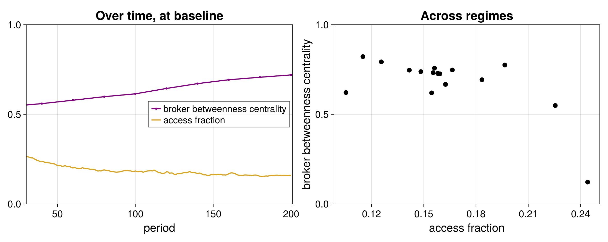

  

<section class="tb-section tb-section--turn" aria-labelledby="digital-turn">
  
Context

  <h2 id="digital-turn">After the digital turn</h2>
  
What happens when <strong>market matchmaking</strong> is outsourced to corporations using digital technologies to operate at scale?

  

    <article class="tb-card">
      
Within the relationship

      <h3>The parties do the work themselves</h3>
      <svg class="tb-relationship-diagram" viewBox="0 0 360 130" role="img" aria-label="Two parties connected directly to one another">
        <line x1="115" y1="65" x2="245" y2="65" />
        <circle cx="115" cy="65" r="22" />
        <circle cx="245" cy="65" r="22" />
      </svg>
      
Finding each other, sizing each other up, negotiating terms, anticipating what comes next.

    </article>
    <article class="tb-card">
      
Handed to a third party, at scale

      <h3>One actor does it across millions of relations</h3>
      <svg class="tb-scale-diagram" viewBox="0 0 360 160" role="img" aria-label="Many parties connected through one central third party">
        <g class="tb-scale-lines">
          <line x1="180" y1="80" x2="45" y2="35"/><line x1="180" y1="80" x2="90" y2="18"/>
          <line x1="180" y1="80" x2="150" y2="20"/><line x1="180" y1="80" x2="215" y2="18"/>
          <line x1="180" y1="80" x2="280" y2="27"/><line x1="180" y1="80" x2="325" y2="58"/>
          <line x1="180" y1="80" x2="318" y2="120"/><line x1="180" y1="80" x2="260" y2="145"/>
          <line x1="180" y1="80" x2="180" y2="145"/><line x1="180" y1="80" x2="95" y2="140"/>
          <line x1="180" y1="80" x2="38" y2="105"/>
        </g>
        <g class="tb-scale-nodes">
          <circle cx="45" cy="35" r="7"/><circle cx="90" cy="18" r="7"/><circle cx="150" cy="20" r="7"/>
          <circle cx="215" cy="18" r="7"/><circle cx="280" cy="27" r="7"/><circle cx="325" cy="58" r="7"/>
          <circle cx="318" cy="120" r="7"/><circle cx="260" cy="145" r="7"/><circle cx="180" cy="145" r="7"/>
          <circle cx="95" cy="140" r="7"/><circle cx="38" cy="105" r="7"/>
        </g>
        <circle class="tb-scale-center" cx="180" cy="80" r="17"/>
      </svg>
      
It sees every side of every match at once.

    </article>
  

  
The third party comes to <strong>know more than any party it serves.</strong>

</section>

<section class="tb-section" aria-labelledby="brokerage-puzzle">
  
The puzzle

  <h2 id="brokerage-puzzle">The brokerage puzzle</h2>

  

    <article class="tb-card">
      
Theory says

      <h3>Brokerage is fragile</h3>
      
Brokering can undermine trust or eliminate the gaps that generate its value, and brokers need <a href="https://www.pnas.org/doi/10.1073/pnas.1100920108">supporting institutions</a> or <a href="https://www.journals.uchicago.edu/doi/10.1086/730630">deeper interpersonal ties</a> to stabilize their role.

    </article>
    <article class="tb-card">
      
Yet in fact

      <h3>Brokers became giants</h3>
      
Yet many corporate actors in positions of brokerage, from Visa to Amazon, have risen in market power, profit, and prominence even as networks transformed around them.

    </article>
  

  
When can brokering <strong>strengthen rather than undermine</strong> a broker's advantage?

</section>

<section class="tb-section tb-section--model" aria-labelledby="matching-market">
  

    
A simulated matching market

    <h2 id="matching-market">Many clients, one broker</h2>
    
Each client sees only <strong>its own dealings.</strong> The broker sees <strong>across all of them</strong> and pools what it learns.

    <ul class="tb-model-facts" aria-label="Model specifications">
      <li><strong>1</strong> agent-based model in Julia, with <strong>500 to 1,500</strong> agents</li>
      <li><strong>98</strong> effective market conditions</li>
      <li><strong>20</strong> seeds per condition, <strong>50</strong> at baseline</li>
      <li><strong>1,990</strong> simulated runs</li>
    </ul>
    
Agent-based simulation as a bridge from social theory to testable predictions.

  

  
</section>

<section class="tb-section" aria-labelledby="brokerage-argument">
  
The argument

  <h2 id="brokerage-argument">Brokerage is <strong>outsourced relational work.</strong></h2>
  
Through it, the broker learns about cross-market complementarities.

  <ol class="tb-flow">
    <li>01The broker matches parties who can't easily find or evaluate each other.</li>
    <li>02Each match leaves an informational byproduct the broker accumulates.</li>
    <li>03The broker gets better at evaluating the value of potential matches.</li>
    <li>04Shielded by the corporate form, the broker accumulates data and builds information architectures.</li>
    <li>05The broker can use this informational advantage to transition from broker to principal.</li>
  </ol>

  
Brokerage can disappear because of the broker's <strong>power</strong>, not its fragility.

  
<strong>Example</strong> Amazon hosts third-party sellers, sees what sells best, then enters those lines and competes with them.

  
<strong>Example</strong> Former broker-dealer associations turned for-profit stock exchange groups now make most of their profit not directly from intermediation activity, but from selling data feeds and analytics.

</section>

<section class="tb-section tb-section--result" aria-labelledby="brokerage-result">
  

    
    

      
<strong>Over time.</strong> The broker's betweenness centrality rises even as a smaller share of its matches connect parties not already linked.

      
<strong>Across market regimes.</strong> Higher centrality goes with a lower share of such new connections.

    

  

  

    
A central result

    <h2 id="brokerage-result">The most central brokers can be the ones that <strong>bridge the least.</strong></h2>
    
<strong>Broker centrality is endogenous:</strong> clients outsource to the broker because its assessments are valuable, not because its bridging position provides access.

  

  

    <a href="https://github.com/m-laprise/brokerage-abm"><strong>View the model on GitHub</strong></a>
    <a href="mailto:mlaprise@princeton.edu">Manuscript available on demand</a>
  

</section>
